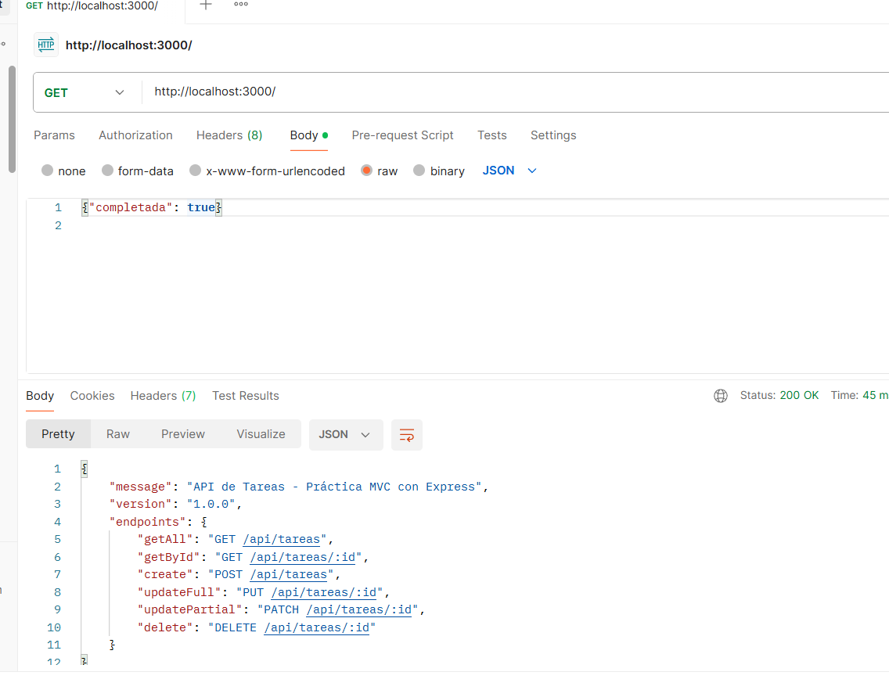
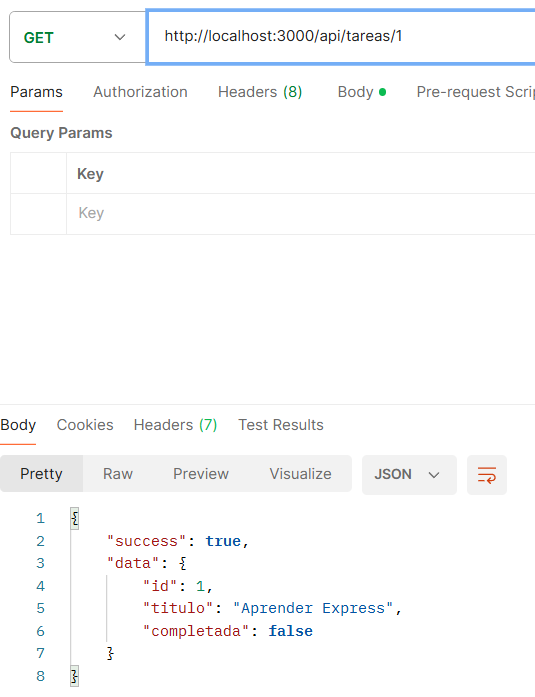
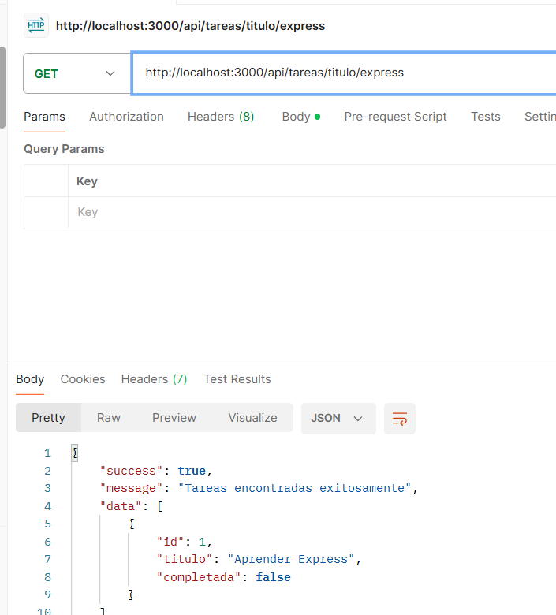
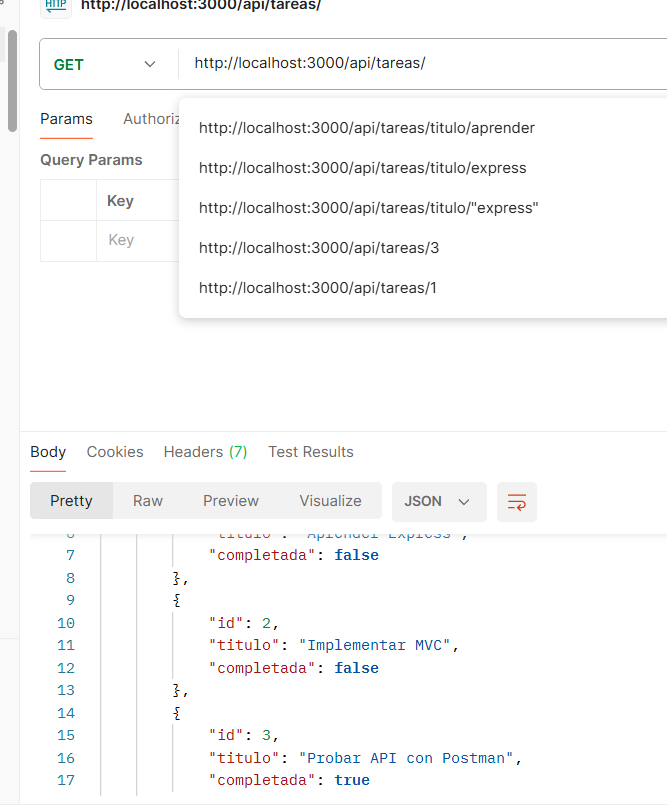
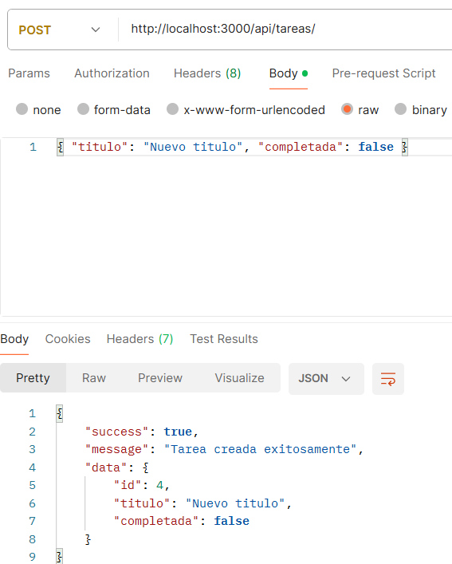
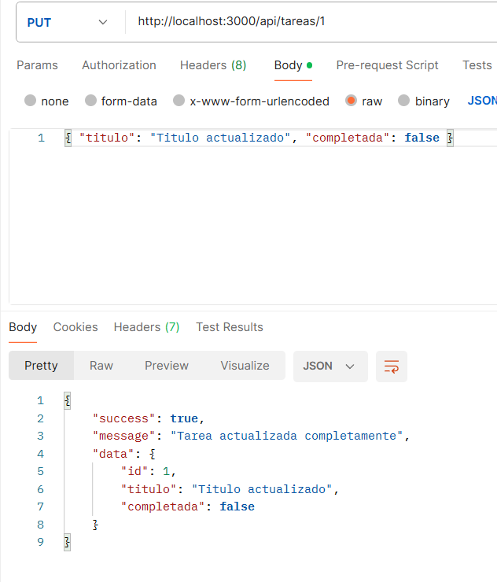
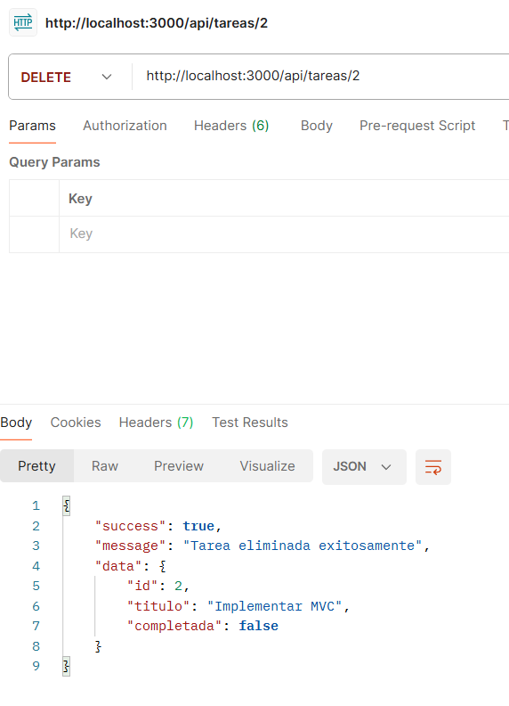

# 📝 API REST de Gestión de Tareas

Una API RESTful para la gestión de tareas desarrollada con **Node.js** y **Express**, implementando la arquitectura **MVC (Modelo-Vista-Controlador)** y utilizando un arreglo en memoria para la simulación de datos.

---

## 📋 Descripción del proyecto

Esta aplicación proporciona un backend completo para la administración de tareas (CRUD). Permite realizar operaciones como consultar todas las tareas (con opción de salida en JSON o texto plano), buscar tareas por ID o título, crear nuevas tareas, actualizarlas de forma total o parcial, y eliminarlas.

### ✨ Características principales
- **Arquitectura MVC**: Separación clara entre el modelo de datos, las rutas y los controladores.
- **Formatos dinámicos**: Soporte para devolución de respuestas en `JSON` o `text/plain` mediante el query parameter `?formato=text`.
- **Manejo de errores centralizado**: Respuestas estructuradas para errores 400, 404 y 500.
- **Colección de pruebas**: Archivo `.http` incluido para probar endpoints directamente desde el editor.

---

## ⚙️ Instrucciones de instalación

1. **Clonar el repositorio** (o acceder a la carpeta del proyecto):
   git clone linh-del-github
   cd tu-proyecto
   npm install

GET / — Mensaje de bienvenida y documentación inicial
GET /api/tareas — Obtener todas las tareas (Soporta ?formato=text para texto plano o JSON por defecto)

GET /api/tareas/:id — Obtener una tarea específica por su ID

GET /api/tareas/titulo/:titulo — Buscar tareas por coincidencia en el título

POST /api/tareas — Crear una nueva tarea (Body: { "titulo": string, "completada"?: boolean })

PUT /api/tareas/:id — Actualización completa de una tarea (Body: { "titulo": string, "completada": boolean })

PATCH /api/tareas/:id — Actualización parcial de una tarea (Body: { "titulo"?: string, "completada"?: boolean })

DELETE /api/tareas/:id — Eliminar una tarea por su ID

funcionamiento:

